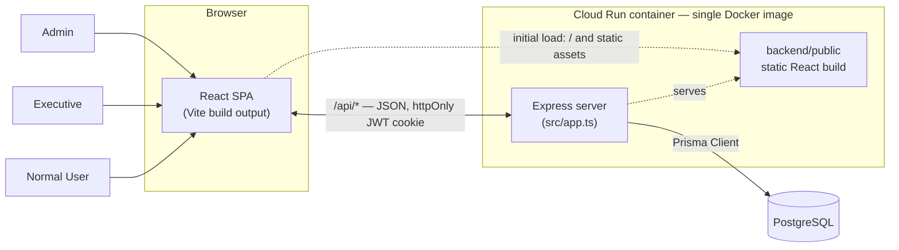
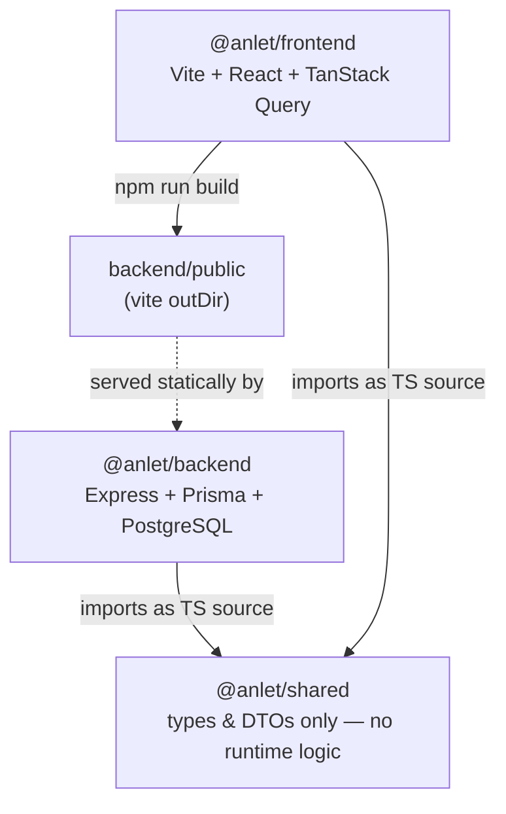
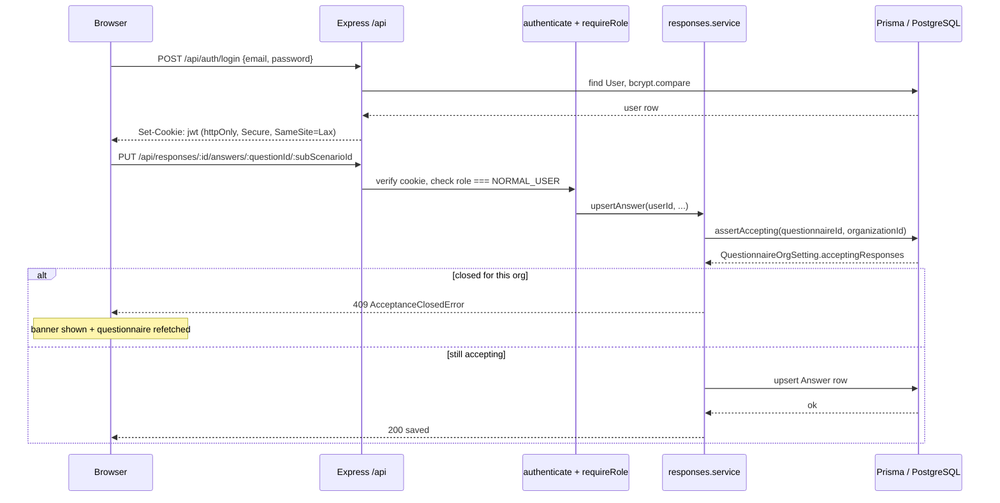
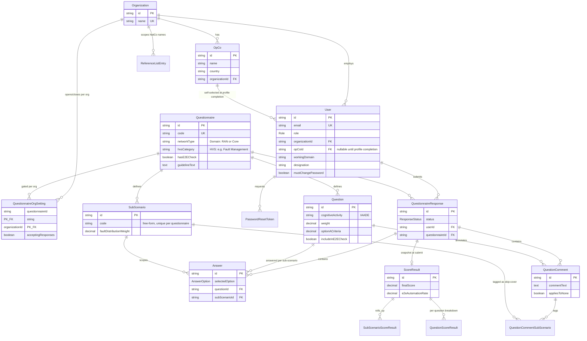
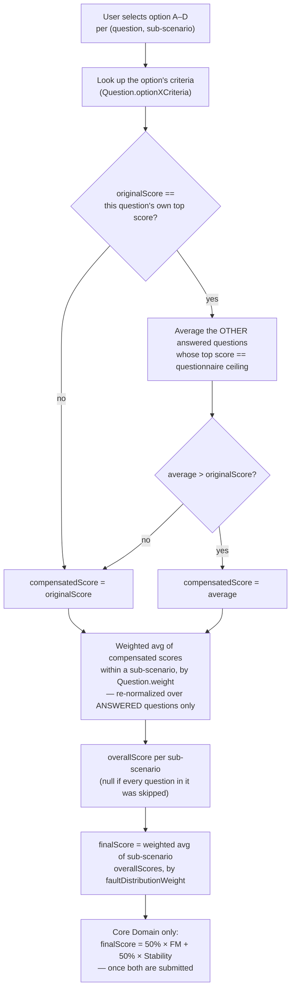
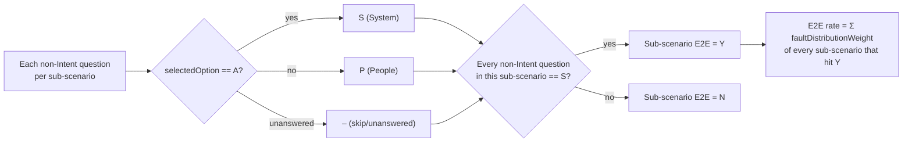

# ANLET — System Architecture

**System architecture — reference & onboarding**

A cloud application replacing the manual, Excel-based TM Forum Autonomous Network (AN L0–L5) maturity assessment process — questionnaires, scoring, and cross-CSP benchmarking, served from a single deployable unit.

**3** questionnaires · **9** backend modules · **16** Prisma models · **3** roles · **65** tests passing

Stack: TypeScript · Express · Prisma · PostgreSQL · React + Vite · TanStack Query · Docker · Cloud Run

---

## Contents

- [System overview](#system-overview)
- [Monorepo & backend modules](#monorepo--backend-modules)
- [Request & auth flow](#request--auth-flow)
- [Data model](#data-model)
- [Domain logic: the scoring engine](#domain-logic-the-scoring-engine)
- [Frontend](#frontend)
- [Field notes](#field-notes)

---

## System overview

### One image, one process, one database

The app is a single-host deployment: one Express process serves the `/api/*` routes *and* the built React SPA from the same origin. There's no separately-hosted frontend and no CORS layer — the browser only ever talks to the one Cloud Run container it was served from. Locally, two dev processes run for hot-reload convenience (Vite on one port proxying `/api` to `tsx watch` on another); that's a dev-time-only split.

Same-origin API + static hosting, no CORS layer. Auth is custom email/password (bcrypt), session carried in an httpOnly/Secure/SameSite=Lax JWT cookie — no external auth vendor, no self-signup.

> **Why single-host:** the app deliberately trades horizontal frontend/backend scaling flexibility for operational simplicity — one image to build, one service to deploy, no CORS/cookie-domain configuration to get wrong. Fits the deployment scale (per-organization CSP benchmarking, not consumer traffic).

---

## Monorepo & backend modules

### Three workspaces, nine domain modules

Plain npm workspaces (no Turborepo/Nx). `shared` holds types/enums only and is consumed as TypeScript source directly by the other two — no build step, no runtime logic, so frontend and backend can't drift on vocabulary like `Role` or DTO shapes.

Inside `backend/src/modules`, each domain gets its own `routes → controller → service` stack talking to Prisma. `scoring` is the one exception — a pure-function module with zero Prisma/Express imports, unit-testable without a database.

| Module | Mount | Responsibility | Notable |
|---|---|---|---|
| `auth` | `/api/auth` | Login/logout, profile completion, password change/reset | `GET /me` reads fresh from DB, not just the JWT payload |
| `organizations` | `/api/organizations` | Admin: create org; hosts `insights` routes at the same prefix | Per-route `authenticate`/`requireRole`, not a blanket `router.use` — see Field notes |
| `opcos` | `/api/opcos` | NatCo list (scoped to caller's org), Admin create | Backs profile completion & the Deep-Dive NatCo list |
| `users` | `/api/users` | Admin: list/reassign/bulk-create users | Reassigning org always clears `opCoId` unless a valid new one is supplied |
| `questionnaire` | `/api/questionnaires` | Read-only structure per code; accepting-responses toggle | Toggle resolved per `QuestionnaireOrgSetting`, defaults `true` if no row |
| `responses` | `/api/responses` | Answer / delete-answer / comment / submit / result / Core Domain summary | Literal `/core-domain-summary` registered before `/:id` — see Field notes |
| `referenceLists` | `/api/reference-lists` | Admin-managed picklists: Country, Working Domain, Designation (global), NatCo Name (per-org) | Prevents free-text spelling drift in benchmarking dimensions |
| `insights` | (under `organizations`) | Benchmarking table, answer drill-down, comment collection | Shares one `computeBenchmarkRows` helper across Admin/Executive views |
| `scoring` | — no routes — | Pure scoring engine: compensation, re-normalization, E2E ratio | Zero Prisma/Express imports; called by `responses.service` at submit time |

---

## Request & auth flow

### Cookie session in, guarded mutation out

Every mutating request to `responses` passes through the same shape: authenticate the JWT cookie, check role, then — for answer/comment/submit calls specifically — resolve whether the caller's organization is still accepting responses for that questionnaire before touching any data.

---

## Data model

### Org hierarchy, questionnaire structure, response/score snapshot

Three clusters: **org hierarchy** (Organization → OpCo → User, plus admin-managed reference picklists), **questionnaire structure** (Questionnaire → Question/SubScenario, read-only content parsed from the source xlsx files), and **response data** (one QuestionnaireResponse per user per questionnaire, holding Answers/Comments while in progress and a write-once ScoreResult snapshot once submitted).

16 models total. Join/result tables (`QuestionCommentSubScenario`, `SubScenarioScoreResult`, `QuestionScoreResult`) are omitted from the attribute blocks above for legibility — see `schema.prisma` for full field lists.

**Design decision — `SubScenario.code`:** a plain string, not a Prisma enum. RAN's 5 fixed codes worked as an enum until Core FM introduced a new one and Stability needed a synthetic single sub-scenario (`"OVERALL"`). Unique per questionnaire, not globally.

**Design decision — per-org acceptance:** acceptance is per `(questionnaire, organization)` via `QuestionnaireOrgSetting`, not a global flag on `Questionnaire`. One org can close a questionnaire without affecting any other org's respondents.

---

## Domain logic: the scoring engine

Pure functions in `scoring.ts`, zero I/O. Given a set of answers, it derives a per-question compensated score, rolls those up into a per-sub-scenario score, then into one final score — plus, separately, an end-to-end automation ratio.

Compensation is a general rule derived from each question's own criteria (topScore vs. questionnaire ceiling), not a hardcoded anchor list — validated unchanged against RAN FM (5 anchors), Core FM (5 anchors, different set), and Core Stability (nothing ever compensates, since every question shares the same top score).

The Intent question is excluded from this check for both RAN FM and Core FM (Core Stability has no E2E section at all — `hasE2ECheck = false`). A skipped non-Intent question renders "–" and counts as not-S, so E2E "Y" can never be reached with an uncovered gap in the sub-scenario.

> **Golden-master fixture** (RAN FM, verified against the source xlsx's own demo answers): `[A,B,A,A,A]`, `[A,A,B,A,A]`, then all-`A` for the remaining 6 questions → sub-scenario scores Equipment 4, ProcessingError 3.83, Communications 3.8, Environmental 4, Security 4 → **final score 3.9145**, E2E Y/Y/N/Y/Y → **E2E rate 0.7**.

---

## Frontend

### Role-gated routes over one shared API

React + Vite + TanStack Query. `ProtectedRoute` gates every route by role, and additionally redirects any `NORMAL_USER` with `opCoId == null` to `/profile` before they can reach the domain picker. A shared `AppHeader` (Home link, logged-in email, Logout) sits on every page.

| Role | Entry point | Core pages |
|---|---|---|
| `NORMAL_USER` | `/profile` → `/domain` | ProfilePage → DomainPickerPage → QuestionnairePage (question-major stepper, autosave) → ResultsPage |
| `EXECUTIVE` | `/executive` | ExecutivePage: respondents table, own-org OpCo benchmarking, answer-distribution drilldown, Comment Collection, Excel/PDF export |
| `ADMIN` | `/admin` | AdminPage (org/OpCo/user creation, questionnaire accept-toggle, cross-org benchmarking) → OrganizationDeepDivePage per org |

Reusable building blocks carry most of the cross-page consistency: `SortableTable`/`BenchmarkTable` (Excel-like sort/filter, shared by Admin and Executive), `GroupedCommentsList` (Cognitive-Activity-grouped comments, shared by the Review step, Results page, and Deep-Dive page), and `AnswerDistributionDrilldown` (per-question/option counts that expand into per-respondent detail, shared by Executive and Deep-Dive).

---

## Field notes

Six behaviors that looked correct, weren't, and were only caught by an integration test flaking or a manual browser walkthrough — not by inspection. Worth reading before assuming a "plausible" refactor is safe.

**Blanket `router.use()` intercepts sibling routers at the same prefix.**
A router-level `router.use(authenticate, requireRole(...))` with no path applies to every sub-path under that mount, even ones defined by a *different* router mounted at the same prefix later. `organizations.routes.ts` applies auth per-route instead, since it hosts both Admin-only and broader-role routes at `/organizations`.

**Literal routes must be registered before `:param` routes.**
`responses.routes.ts`'s literal `/core-domain-summary` is registered before `/:id` — otherwise Express's wildcard param route would swallow it as if `"core-domain-summary"` were an `:id`.

**Postgres doesn't guarantee row order without `ORDER BY`.**
A DB-backed integration test comparing a freshly-computed score result against the persisted-then-reread one flaked on an unrelated rerun once table contents shifted physical row order. Fixed with explicit `orderBy: { sortOrder: 'asc' }` everywhere a `ScoreResultDto` is assembled from the DB.

**A textarea blur can race a checkbox's save.**
Clicking a sub-scenario tag while the comment textarea is focused blurs the textarea first — its save could race the checkbox's own save over the network, and whichever response arrived last silently won. Fixed by folding comment text + tags + `appliesToNone` into one local state object with a single debounced save path.

**xlsx sheet column offsets aren't consistent within one file.**
RAN_FM.xlsx's `Guideline` sheet's used range starts at column B, not A, unlike every other sheet the parsers read — SheetJS trims arrays to the used range, so hardcoded column indices silently returned `null` for every cell instead of erroring. Caught by a failing parser test, not by inspection.

**"Get or create" must handle every existing status, not just one.**
`getOrCreateResponse` originally only checked for an existing `IN_PROGRESS` response, so a `SUBMITTED` one meant "silently create a fresh one" — caught during manual browser testing, not by a unit test. It's now single-shot per user per questionnaire regardless of status.

---

*ANLET — TM Forum AN maturity assessment platform. Generated from repo state at commit `bc5c0a5`.*
