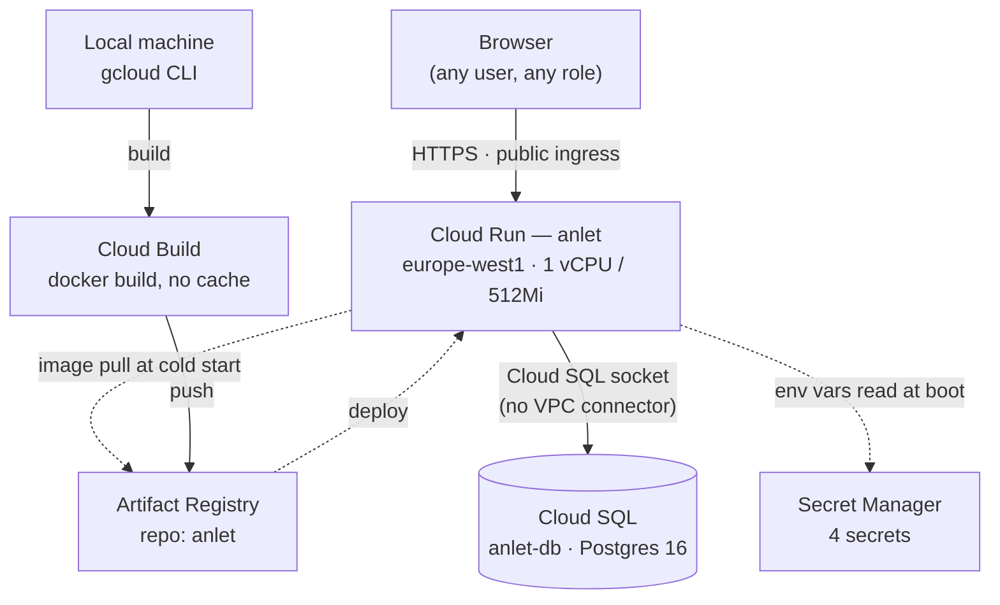

# ANLET — GCP Deployment

**Infrastructure reference — companion to [design.md](design.md)**

How ANLET actually runs in Google Cloud today. Every resource, config value, and IAM binding below was read live from the `anlet-504021` project via `gcloud` on **2026-08-04** — not reconstructed from memory or from a Terraform/Cloud Build config file (neither exists in this repo; the deployment was provisioned by hand).

Five managed services carry the whole deployment. No Kubernetes, no VPC, no load balancer — the app is one container, one database, and everything else exists to feed or protect those two things.

| Service | Role | Status |
|---|---|---|
| Cloud Run | Runs the app container | ✅ running |
| Cloud SQL | Postgres database | ⚠️ automated backups disabled |
| Artifact Registry | Holds built images | ✅ 1 repo |
| Secret Manager | Holds credentials | ✅ 4 secrets |
| Cloud Build | Builds the image | ⚠️ manual only, no trigger |

---

## Contents

- [Request & deploy flow](#request--deploy-flow)
- [Service reference](#service-reference)
  - [Cloud Run](#cloud-run)
  - [Cloud SQL](#cloud-sql)
  - [Artifact Registry](#artifact-registry)
  - [Secret Manager](#secret-manager)
  - [Cloud Build](#cloud-build)
- [IAM & identity](#iam--identity)
- [Environment variables](#environment-variables)
- [Networking & security posture](#networking--security-posture)
- [Deploy & operate](#deploy--operate)
- [Known gaps](#known-gaps)

---

## Request & deploy flow

Two independent paths through the same five services: a request path (every page load) and a deploy path (only when a new image ships).



On every cold start, the container's own `CMD` (see [`Dockerfile`](Dockerfile)) runs `prisma migrate deploy` against Cloud SQL before the server starts — schema migrations are self-applying, not a separate deploy step.

---

## Service reference

What's provisioned, and the reasoning behind each choice — grounded in this app's own shape (a single Node/Express container, one Postgres database, no background workers, no fan-out traffic).

### Cloud Run

| Field | Value |
|---|---|
| Service | `anlet` |
| Region | `europe-west1` |
| Image | `europe-west1-docker.pkg.dev/anlet-504021/anlet/anlet:latest` |
| Resources | 1000m CPU · 512Mi memory · concurrency 80 |
| Scaling | min 0 (scale-to-zero) → max 20 instances |
| Request timeout | 300s |
| Startup probe | TCP :8080 · period 240s · timeout 240s · 1 retry |
| Ingress | all (public internet) |
| Invoker IAM | `allUsers` → `roles/run.invoker` |
| Runtime service account | `766709294259-compute@developer.gserviceaccount.com` |

> **Why Cloud Run, not GKE / Compute Engine:** the app is one stateless container serving both the API and the built React app (see `design.md`'s single-host model) — there's no multi-service mesh, no need for pod-level orchestration, and traffic is modest enough that scale-to-zero between demos/usage windows matters more than always-on capacity. Cloud Run gives HTTPS, autoscaling, and revision-based rollback for free, without a cluster to patch or size.

### Cloud SQL

| Field | Value |
|---|---|
| Instance | `anlet-db` |
| Engine | PostgreSQL 16 |
| Tier | `db-f1-micro` (shared core) |
| Zone | `europe-west1-b` |
| Availability | ZONAL — ⚠️ no standby |
| Storage | 10GB SSD (PD_SSD) |
| Connectivity | Public IP `35.187.175.128` · SSL allowed, not required |
| Automated backups | ⚠️ disabled |
| Connection name | `anlet-504021:europe-west1:anlet-db` |

> **Why Cloud SQL, and why the socket connector over a VPC connector:** Prisma needs a real Postgres endpoint, and Cloud SQL gives that without hand-rolling replication or patching. Cloud Run reaches it through the built-in Cloud SQL Unix-socket integration (the `run.googleapis.com/cloudsql-instances` annotation plus `roles/cloudsql.client` on the runtime service account) rather than a Serverless VPC Access connector — there's no other private resource the app needs to reach, so a VPC connector would add monthly cost and network config for zero additional benefit.

### Artifact Registry

| Field | Value |
|---|---|
| Repository | `anlet` |
| Format | Docker, `STANDARD_REPOSITORY` |
| Location | `europe-west1` |
| Current size | ~469MB |

> **Why Artifact Registry, not Container Registry:** Container Registry (the older `gcr.io` product) is still enabled on this project as a legacy leftover, but the actual repo lives in Artifact Registry — Google's current, regionally-colocated successor. Keeping the image in the same region as the Cloud Run service (europe-west1) avoids a cross-region pull on every cold start.

### Secret Manager

| Secret | Injected as | Versions |
|---|---|---|
| `anlet-database-url` | `DATABASE_URL` | 1 |
| `anlet-jwt-secret` | `JWT_SECRET` | 1 |
| `anlet-admin-password` | `ADMIN_PASSWORD` | 1 |
| `anlet-smtp-password` | `SMTP_PASSWORD` | 1 |

> **Why Secret Manager over plain Cloud Run env vars:** credentials (DB connection string, JWT signing key, bootstrap admin password, SMTP password) are mounted via `secretKeyRef` rather than set as literal env var values — they never appear in `gcloud run services describe` output or Cloud Run's revision history in plaintext, only the secret *reference* does. Everything non-sensitive (`NODE_ENV`, `ADMIN_EMAIL`, SMTP host/port/user, `APP_BASE_URL`) stays as a plain env var since there's no confidentiality benefit to secreting it.

### Cloud Build

| Field | Value |
|---|---|
| Trigger | none configured — manual only |
| Recent builds | 3 successful, all 2026-07-31 |
| Build step | `docker build --network cloudbuild --no-cache -t <image> .` |
| Source | local working tree, uploaded per-run to `gs://anlet-504021_cloudbuild` |

> **Why Cloud Build, and why it isn't automated yet:** Cloud Build here does exactly one job — running the multi-stage `Dockerfile` build remotely so a full Node/Prisma toolchain doesn't need to exist locally. It's invoked ad hoc (`gcloud builds submit`) rather than via a GitHub-connected trigger, so a merge to `main` does not currently produce a new deployment on its own — see [Known gaps](#known-gaps).

---

## IAM & identity

One human owner, one working service account, and a handful of Google-managed service agents that GCP creates automatically per enabled API — those last ones aren't something anyone granted by hand.

| Principal | Role | Notes |
|---|---|---|
| `jaserbin.rahman@detecon.com` | `roles/owner` | Human account, full project control |
| `766709294259-compute@developer.gserviceaccount.com` | `roles/editor`, `roles/cloudsql.client` | Default Compute SA — this is what Cloud Run actually runs as ⚠️ broad |
| `…@gcp-sa-artifactregistry…` | `roles/artifactregistry.serviceAgent` | Google-managed, auto-created |
| `…@cloudbuild.gserviceaccount.com` | `roles/cloudbuild.builds.builder` | Google-managed, auto-created |
| `…@gcp-sa-cloudbuild…` | `roles/cloudbuild.serviceAgent` | Google-managed, auto-created |
| `…@containerregistry…` | `roles/containerregistry.ServiceAgent` | Legacy, unused |
| `…@gcp-sa-pubsub…` | `roles/pubsub.serviceAgent` | Google-managed, unused by the app |
| `…@serverless-robot-prod…` | `roles/run.serviceAgent` | Google-managed, powers Cloud Run itself |

> **Worth knowing:** Cloud Run wasn't given its own scoped service account — it runs as the project's default Compute Engine SA, which also happens to hold project-wide `roles/editor`. That's far more than the app needs (it only ever calls Cloud SQL). Listed under [Known gaps](#known-gaps), not fixed here.

---

## Environment variables

Every value the container reads at boot, and where it comes from.

| Variable | Source | Value / purpose |
|---|---|---|
| `NODE_ENV` | plain | `production` |
| `ADMIN_EMAIL` | plain | Bootstrap Admin account, created by `prisma/seed/seed.ts` |
| `APP_BASE_URL` | plain | `https://anlet-766709294259.europe-west1.run.app` — used to build links (e.g. password reset emails) |
| `SMTP_HOST` / `PORT` / `USER` / `FROM` | plain | `smtp.placeholder.invalid` — ⚠️ placeholder |
| `DATABASE_URL` | Secret Manager | Postgres connection string over the Cloud SQL Unix socket (`/cloudsql/anlet-504021:europe-west1:anlet-db`) |
| `JWT_SECRET` | Secret Manager | Signs the httpOnly auth cookie |
| `ADMIN_PASSWORD` | Secret Manager | Bootstrap Admin password, consumed once by the idempotent seed script |
| `SMTP_PASSWORD` | Secret Manager | ⚠️ placeholder — not a real credential yet |

---

## Networking & security posture

| Aspect | Detail |
|---|---|
| Ingress | Cloud Run accepts traffic from the open internet (`ingress: all`); `allUsers` holds `run.invoker`. Intentional — the app gates access with its own email/password login, not an infrastructure-level wall. |
| TLS | Terminated automatically by Cloud Run on its default `*.run.app` domain (Google-managed certificate). No custom domain is mapped. |
| VPC | None. No Serverless VPC Access connector, no private services — Cloud SQL is reached over its public IP via the built-in Unix-socket connector, authenticated by IAM (`cloudsql.client`), not network isolation. |
| Database TLS | SSL is *allowed* on Cloud SQL connections but not *required* (`sslMode: ALLOW_UNENCRYPTED_AND_ENCRYPTED`). |
| Same-origin | No CORS layer exists or is needed — the built frontend is served by the same Express process as the API (see `design.md`'s single-host model). |

---

## Deploy & operate

The commands below are reconstructed from the live Cloud Run revision config — there's no committed deploy script in this repo. Running them as shown reproduces the current service.

**Build the image and push it to Artifact Registry:**

```bash
# from the repo root, where the Dockerfile lives
gcloud builds submit \
  --project anlet-504021 \
  --tag europe-west1-docker.pkg.dev/anlet-504021/anlet/anlet:latest .
```

**Deploy that image to Cloud Run:**

```bash
gcloud run deploy anlet \
  --project anlet-504021 \
  --region europe-west1 \
  --image europe-west1-docker.pkg.dev/anlet-504021/anlet/anlet:latest \
  --platform managed \
  --allow-unauthenticated \
  --add-cloudsql-instances anlet-504021:europe-west1:anlet-db \
  --cpu 1 --memory 512Mi \
  --concurrency 80 --max-instances 20 --timeout 300 \
  --set-env-vars NODE_ENV=production,ADMIN_EMAIL=<email>,APP_BASE_URL=https://anlet-766709294259.europe-west1.run.app \
  --set-secrets DATABASE_URL=anlet-database-url:latest,JWT_SECRET=anlet-jwt-secret:latest,ADMIN_PASSWORD=anlet-admin-password:latest,SMTP_PASSWORD=anlet-smtp-password:latest
```

**Roll a secret (e.g. rotate the JWT signing key):**

```bash
# add a new version — old one stays valid until you redeploy
echo -n "<new-value>" | gcloud secrets versions add anlet-jwt-secret \
  --project anlet-504021 --data-file=-

# Cloud Run only re-reads secrets on a new revision, so redeploy after:
gcloud run services update anlet --project anlet-504021 --region europe-west1
```

**Roll back to a previous revision:**

```bash
gcloud run revisions list --service anlet --project anlet-504021 --region europe-west1

gcloud run services update-traffic anlet \
  --project anlet-504021 --region europe-west1 \
  --to-revisions anlet-00003-pbb=100
```

**Tail live logs:**

```bash
gcloud beta run services logs tail anlet --project anlet-504021 --region europe-west1
```

**Connect to the database directly (e.g. for a manual query):**

```bash
# Cloud SQL Auth Proxy — safer than using the public IP straight from a laptop
cloud-sql-proxy anlet-504021:europe-west1:anlet-db &
psql "host=127.0.0.1 port=5432 sslmode=disable dbname=<db> user=<user>"
```

---

## Known gaps

Documented as found, not fixed. Roughly ordered by how much it'd hurt if it bit you.

- **Backups** — automated Cloud SQL backups are disabled. A retention policy (7 backups) is configured but never runs. A dropped table or bad migration today has no restore point.
- **High availability** — Cloud SQL is zonal, not regional. A zone outage in `europe-west1-b` takes the database down with no automatic failover.
- **IAM scope** — Cloud Run runs as the default Compute SA with project-wide `roles/editor`. A compromised container could touch far more than the database it needs. A scoped custom service account (just `cloudsql.client` + Secret Manager accessor) would be tighter.
- **CI/CD** — deploys are manual. The GitHub Actions workflow (`.github/workflows/ci.yml`) only runs lint/typecheck/test — it doesn't build or deploy. Every release today is someone running `gcloud builds submit` + `gcloud run deploy` by hand.
- **SMTP** — email is wired to placeholder values (`smtp.placeholder.invalid`). The password-reset flow's emails currently have nowhere real to send.
- **Domain** — no custom domain; the app is only reachable at its `*.run.app` URL.
- **Secret rotation** — all 4 Secret Manager secrets are still on version 1 since creation.
- **Observability** — no Cloud Monitoring alert policies and no logging sinks exist beyond the defaults — a crash loop or cost spike wouldn't page anyone.
- **Housekeeping** — the project has several enabled-but-unused APIs left over from project bootstrap (BigQuery, Pub/Sub, Datastore, Dataform, Analytics Hub, and the legacy Container Registry API). None are called by the app; safe to disable during a cleanup pass.

---

*Verified live against project `anlet-504021` via `gcloud` on 2026-08-04. Companion doc: [design.md](design.md) — ANLET System Architecture.*
