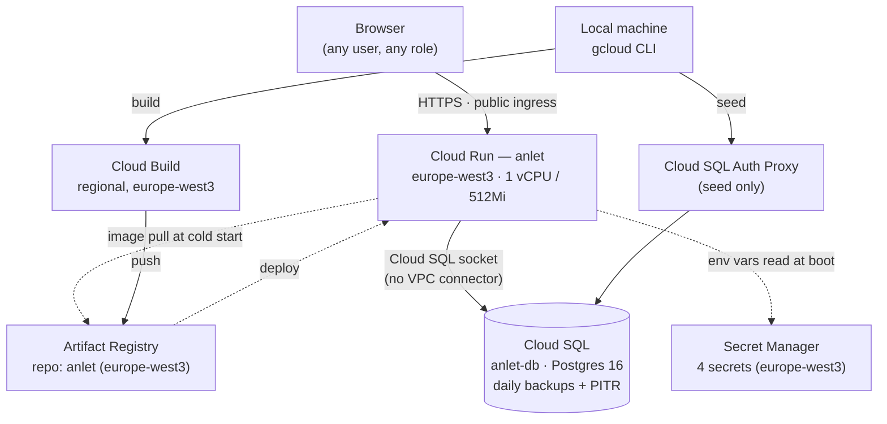

# ANLET — GCP Deployment

**Infrastructure reference — companion to [design.md](design.md)**

How ANLET runs in Google Cloud. Every resource, config value, and IAM binding below was read live from the
`anlet-504115` project via `gcloud` on **2026-10-04**, right after the migration from the old personal project
`anlet-504021` (see [Migration history](#migration-history) and [GCP_MIGRATION_PLAN.md](GCP_MIGRATION_PLAN.md)). There
is still no Terraform/Cloud Build config in this repo — the deployment is provisioned with the `gcloud` commands
documented here.

Five managed services carry the whole deployment. No Kubernetes, no VPC, no load balancer — the app is one container,
one database, and everything else exists to feed or protect those two things.

| Service | Role | Status |
|---|---|---|
| Cloud Run | Runs the app container | ✅ running |
| Cloud SQL | Postgres database | ✅ daily backups + point-in-time recovery |
| Artifact Registry | Holds built images | ✅ 1 repo |
| Secret Manager | Holds credentials | ✅ 4 secrets, stored in europe-west3 |
| Cloud Build | Builds the image | ⚠️ manual only, no trigger |

**App URL:** <https://anlet-602185048647.europe-west3.run.app> (Cloud Run also answers on the equivalent legacy URL
`https://anlet-epvm7rp76a-ey.a.run.app`; `APP_BASE_URL` uses the first).

---

## Contents

- [Company constraints](#company-constraints)
- [Request & deploy flow](#request--deploy-flow)
- [Service reference](#service-reference)
- [IAM & identity](#iam--identity)
- [Environment variables](#environment-variables)
- [Networking & security posture](#networking--security-posture)
- [Deploy & operate](#deploy--operate)
- [Known gaps](#known-gaps)
- [Migration history](#migration-history)

---

## Company constraints

`anlet-504115` sits in a Detecon folder (`folders/898244998347`) and inherits organization policies. The ones that
matter for this app, checked on 2026-10-04:

| Policy | Effect on ANLET |
|---|---|
| `gcp.resourceLocations` | **EU locations only.** Everything is in `europe-west3` (Frankfurt). Anything "global" by default must be pinned to a region: Secret Manager secrets use user-managed replication in `europe-west3`, and Cloud Build runs regionally (`--region europe-west3 --default-buckets-behavior regional-user-owned-bucket`). |
| `iam.allowedPolicyMemberDomains` | Allows all — `allUsers` can be granted `run.invoker`, so the app is publicly reachable. |
| `run.allowedIngress`, `sql.restrictPublicIp` | Not restricting. |

---

## Request & deploy flow



On every cold start, the container's own `CMD` (see [`Dockerfile`](Dockerfile)) runs `prisma migrate deploy` before the
server starts — schema migrations are self-applying. **The seed is not** part of the container (it parses the xlsx
files, which aren't in the image); it's run from a developer machine through the Cloud SQL Auth Proxy — see
[Deploy & operate](#deploy--operate).

---

## Service reference

### Cloud Run

| Field | Value |
|---|---|
| Service | `anlet` |
| Region | `europe-west3` |
| Image | `europe-west3-docker.pkg.dev/anlet-504115/anlet/anlet:latest` |
| Resources | 1 CPU · 512Mi memory · concurrency 80 · startup CPU boost |
| Scaling | min 0 (scale-to-zero) → max 20 instances |
| Request timeout | 300s |
| Ingress | all (public internet) |
| Invoker IAM | `allUsers` → `roles/run.invoker` |
| Runtime service account | `602185048647-compute@developer.gserviceaccount.com` |

> **Why Cloud Run, not GKE / Compute Engine:** the app is one stateless container serving both the API and the built
> React app (see `design.md`'s single-host model). Cloud Run gives HTTPS, autoscaling, scale-to-zero and revision-based
> rollback without a cluster to patch or size.

### Cloud SQL

| Field | Value |
|---|---|
| Instance | `anlet-db` |
| Engine | PostgreSQL 16, Enterprise edition |
| Tier | `db-f1-micro` (shared core) |
| Zone | `europe-west3-a` |
| Availability | ZONAL — ⚠️ no standby |
| Storage | 10GB SSD |
| Backups | ✅ daily at 02:00 UTC, 7 retained · point-in-time recovery, 7 days of logs |
| Connectivity | Public IP `34.159.114.49`, **no authorized networks** — reachable only via the authenticated Cloud SQL connector/proxy · SSL allowed, not required |
| Database / app user | `anlet` / `anlet` (password only in the `anlet-database-url` secret) |
| Connection name | `anlet-504115:europe-west3:anlet-db` |

> **Why the socket connector over a VPC connector:** Cloud Run reaches Cloud SQL through the built-in Unix-socket
> integration (`run.googleapis.com/cloudsql-instances` annotation + `roles/cloudsql.client`). There's no other private
> resource the app needs, so a Serverless VPC Access connector would add cost and network config for no benefit.

### Artifact Registry

| Field | Value |
|---|---|
| Repository | `anlet` |
| Format | Docker, standard |
| Location | `europe-west3` |

### Secret Manager

All four use **user-managed replication in `europe-west3`** (automatic/global replication is blocked by the EU location
policy).

| Secret | Injected as | Notes |
|---|---|---|
| `anlet-database-url` | `DATABASE_URL` | `postgresql://anlet:…@localhost/anlet?host=/cloudsql/anlet-504115:europe-west3:anlet-db&schema=public` — password generated at creation, never printed |
| `anlet-jwt-secret` | `JWT_SECRET` | Random 64-char key |
| `anlet-admin-password` | `ADMIN_PASSWORD` | Super admin password (random, generated at creation). Read it with `gcloud secrets versions access latest --secret anlet-admin-password --project anlet-504115`. ⚠️ The seed resets the super admin's password to this value every time it runs. |
| `anlet-smtp-password` | `SMTP_PASSWORD` | ⚠️ placeholder — no real mail provider yet |

### Cloud Build

| Field | Value |
|---|---|
| Trigger | none — manual only |
| Location | `europe-west3` (regional build) |
| Source bucket | `gs://anlet-504115_europe-west3_cloudbuild` (regional, created by `--default-buckets-behavior regional-user-owned-bucket`) |
| Build | the repo's multi-stage `Dockerfile` |

---

## IAM & identity

| Principal | Role | Notes |
|---|---|---|
| `jaserbin.rahman@detecon.com` | `roles/owner` | Human account, full project control; also the app's super admin |
| `602185048647-compute@developer.gserviceaccount.com` | `roles/editor`, `roles/cloudsql.client`, `roles/secretmanager.secretAccessor` | Default Compute SA — Cloud Run runs as it, and Cloud Build uses it. `editor` is granted automatically by Google ⚠️ broad |
| Google-managed service agents | various | Created automatically per enabled API |

---

## Environment variables

| Variable | Source | Value / purpose |
|---|---|---|
| `NODE_ENV` | plain | `production` |
| `ADMIN_EMAIL` | plain | `jaserbin.rahman@detecon.com` — the bootstrap account the seed creates and flags as **super admin** |
| `APP_BASE_URL` | plain | `https://anlet-602185048647.europe-west3.run.app` — used to build links (password-reset emails) |
| `SMTP_HOST` / `PORT` / `USER` / `FROM` | plain | `smtp.placeholder.invalid` / `587` / `placeholder` / `no-reply@placeholder.invalid` — ⚠️ placeholders |
| `DATABASE_URL` | Secret Manager | see `anlet-database-url` |
| `JWT_SECRET` | Secret Manager | Signs the httpOnly auth cookie |
| `ADMIN_PASSWORD` | Secret Manager | Super admin password used by the seed |
| `SMTP_PASSWORD` | Secret Manager | ⚠️ placeholder |

---

## Networking & security posture

| Aspect | Detail |
|---|---|
| Ingress | Public (`ingress: all`, `allUsers` → `run.invoker`). Intentional — the app gates access with its own login. |
| TLS | Terminated by Cloud Run on its `*.run.app` domain (Google-managed certificate). No custom domain. |
| VPC | None. Cloud SQL has a public IP but no authorized networks; access is via the IAM-authenticated connector only. |
| Database TLS | Allowed, not required (`ALLOW_UNENCRYPTED_AND_ENCRYPTED`); the socket connector encrypts in transit anyway. |
| Data residency | All resources in `europe-west3` (Frankfurt), enforced by the company location policy. |

---

## Deploy & operate

**Build the image** (from the repo root, on `main`):

```bash
gcloud builds submit --project anlet-504115 --region europe-west3 \
  --default-buckets-behavior regional-user-owned-bucket \
  --tag europe-west3-docker.pkg.dev/anlet-504115/anlet/anlet:latest .
```

**Deploy it:**

```bash
gcloud run deploy anlet --project anlet-504115 --region europe-west3 \
  --image europe-west3-docker.pkg.dev/anlet-504115/anlet/anlet:latest \
  --allow-unauthenticated \
  --add-cloudsql-instances anlet-504115:europe-west3:anlet-db \
  --cpu 1 --memory 512Mi --concurrency 80 --min-instances 0 --max-instances 20 --timeout 300 \
  --set-env-vars NODE_ENV=production,ADMIN_EMAIL=jaserbin.rahman@detecon.com,APP_BASE_URL=https://anlet-602185048647.europe-west3.run.app,SMTP_HOST=smtp.placeholder.invalid,SMTP_PORT=587,SMTP_USER=placeholder,SMTP_FROM=no-reply@placeholder.invalid \
  --set-secrets DATABASE_URL=anlet-database-url:latest,JWT_SECRET=anlet-jwt-secret:latest,ADMIN_PASSWORD=anlet-admin-password:latest,SMTP_PASSWORD=anlet-smtp-password:latest
```

Schema migrations apply automatically when the new revision starts.

**Seed (needed when questionnaires/xlsx files change, or on a fresh database)** — idempotent; resets the super admin's
password to `anlet-admin-password`:

```bash
# terminal 1 — needs `brew install cloud-sql-proxy`
cloud-sql-proxy --gcloud-auth --address 127.0.0.1 --port 5433 anlet-504115:europe-west3:anlet-db

# terminal 2 — from backend/; secrets go straight into the environment, never printed
DATABASE_URL="$(gcloud secrets versions access latest --secret anlet-database-url --project anlet-504115 \
  | sed -E 's#@localhost/anlet\?host=/cloudsql/[^&]+&#@127.0.0.1:5433/anlet?#')" \
ADMIN_PASSWORD="$(gcloud secrets versions access latest --secret anlet-admin-password --project anlet-504115)" \
ADMIN_EMAIL=jaserbin.rahman@detecon.com JWT_SECRET=unused-by-seed NODE_ENV=production \
SMTP_HOST=smtp.placeholder.invalid SMTP_PORT=587 SMTP_USER=placeholder SMTP_PASSWORD=placeholder \
SMTP_FROM=no-reply@placeholder.invalid APP_BASE_URL=https://anlet-602185048647.europe-west3.run.app \
npm run db:seed
```

**Add a secret version** (e.g. rotate the JWT key, or set real SMTP credentials later), then redeploy so Cloud Run
picks it up:

```bash
echo -n "<new-value>" | gcloud secrets versions add anlet-jwt-secret --project anlet-504115 --data-file=-
gcloud run services update anlet --project anlet-504115 --region europe-west3
```

**Roll back / logs:**

```bash
gcloud run revisions list --service anlet --project anlet-504115 --region europe-west3
gcloud run services update-traffic anlet --project anlet-504115 --region europe-west3 --to-revisions <revision>=100
gcloud beta run services logs tail anlet --project anlet-504115 --region europe-west3
```

**Restore the database** (backups / point-in-time recovery):

```bash
gcloud sql backups list --instance anlet-db --project anlet-504115
# point-in-time recovery creates a new instance from a timestamp:
gcloud sql instances clone anlet-db anlet-db-restore --project anlet-504115 --point-in-time '<RFC3339 timestamp>'
```

---

## Known gaps

- **High availability** — Cloud SQL is zonal (`europe-west3-a`); a zone outage takes the database down.
- **IAM scope** — Cloud Run runs as the default Compute SA, which holds project-wide `roles/editor`. A dedicated SA
  with only `cloudsql.client` + `secretmanager.secretAccessor` would be tighter.
- **CI/CD** — deploys are manual (`gcloud builds submit` + `gcloud run deploy`); GitHub Actions only runs
  lint/typecheck/test.
- **SMTP** — placeholder values; password-reset emails have nowhere to go until a provider is configured
  (`ADMIN_MANAGEMENT_PLAN.md` Phase 3).
- **Domain** — no custom domain; only the `*.run.app` URL.
- **Observability** — no alert policies or log sinks beyond the defaults.

Fixed in the migration: automated backups + point-in-time recovery are now on (they were disabled before); the
database has no authorized networks.

---

## Migration history

- **Until 2026-10-04:** ran in personal project `anlet-504021` (no organization), region `europe-west1`, URL
  `https://anlet-766709294259.europe-west1.run.app`, Cloud SQL without backups.
- **2026-10-04:** migrated to company project `anlet-504115` (Detecon folder), region `europe-west3`, as a **fresh
  start** — new empty database seeded with the questionnaires and the super admin; old data not carried over. Steps
  and decisions: [GCP_MIGRATION_PLAN.md](GCP_MIGRATION_PLAN.md).
- **Old project shutdown:** pending — see GCP_MIGRATION_PLAN.md step 11.

---

*Verified live against project `anlet-504115` via `gcloud` on 2026-10-04. Companion doc: [design.md](design.md).*
